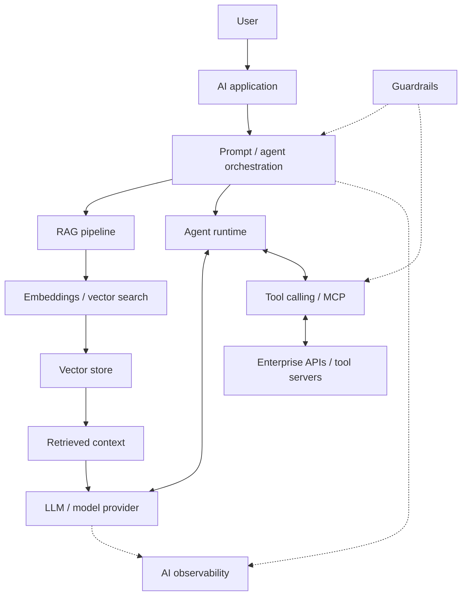
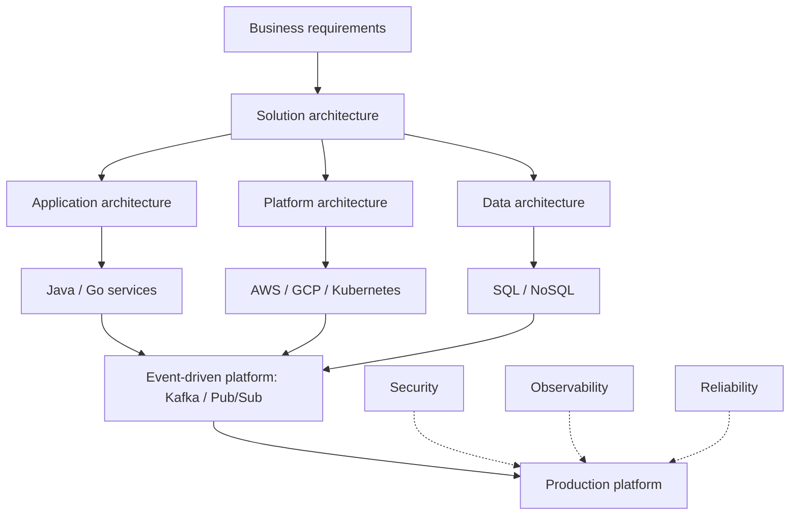
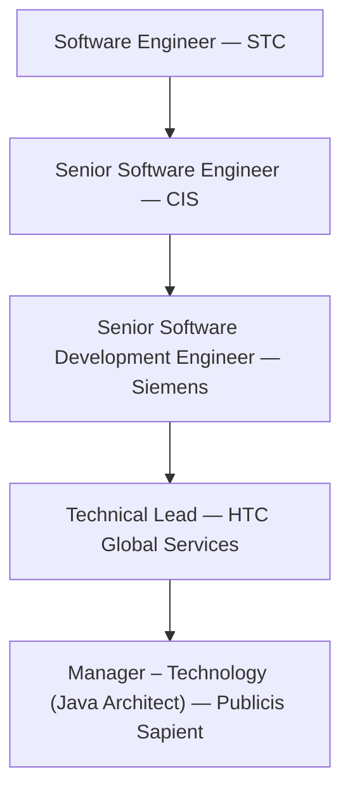

# CHANDRASHEKHAR VISHWAKARMA

**Java / Go SDE-3 & Solution / Software Architect**  
Cloud-Native Systems • Distributed Systems • Microservices • Kafka • AWS/GCP • Generative AI

Senior software engineer and solution architect with **10+ years of experience** designing and delivering secure, scalable, cloud-ready enterprise systems. I combine hands-on Java and Go engineering with architecture leadership, event-driven integration, and production readiness.

**Currently:** Manager – Technology (Java Architect), **Publicis Sapient** — Tesco, onsite.  
**Enterprise experience:** Tesco · World Bank Group · CNA Insurance · Siemens.  
**Developing focus:** Generative AI, RAG, AI agents, and MCP-based application architecture.

[Email](mailto:code.chandrashekhar@gmail.com) · [LinkedIn](https://linkedin.com/in/chandrashekhar-vishwakarma) · [GitHub](https://github.com/techkaizenchandra-code) · [Resume availability](#resume)

## About

- **Architecture through delivery:** Lead solution design from technical discovery, service boundaries, and architecture decisions through implementation, deployment, production readiness, and operations.
- **Hands-on engineering:** Build Java and Go services, microservices, APIs, and asynchronous integrations for enterprise platforms and modernization initiatives.
- **Technical leadership:** Guide architecture and design reviews, engineering standards, estimation, stakeholder discussions, and mentorship, connecting business requirements with practical delivery decisions.
- **AI architecture development:** Extend this systems background into LLM applications, retrieval, tool-using agents, guardrails, and AI observability. This is a developing focus; no production GenAI deployment is claimed here.

**Navigate:** [Career Impact](#career-impact) · [Technical Expertise](#technical-expertise) · [Generative AI](#generative-ai--agentic-systems) · [Architecture](#architecture-expertise) · [Experience](#professional-experience) · [Projects](#featured-projects) · [System Design](#system-design) · [Education](#education) · [Contact](#contact)

## Career Impact

Each outcome below belongs to the employer or engagement named alongside it.

| Evidence                                                       | Context                                                                                          |
| -------------------------------------------------------------- | ------------------------------------------------------------------------------------------------ |
| **10+ years**                                                  | Software engineering and architecture across roles since 2015.                                   |
| **10 engineering pods**                                        | Solution architecture scope for Tesco's enterprise hybrid eventing platform at Publicis Sapient. |
| **30% delivery-efficiency improvement**                        | World Bank Group IFC and IBIS modernization at HTC Global Services.                              |
| **25% reduction in production-escaped defects**                | Engineering quality standards at HTC Global Services.                                            |
| **Thousands of insurance documents**                           | CNA Insurance event-driven document post-processing at HTC Global Services.                      |
| **Millions of records; 20% fewer timeout-related failures**    | Asynchronous reporting and downloads with JasperReports at CIS.                                  |
| **5 customer engagements; 25% higher client satisfaction**     | Client solution design and delivery planning at CIS.                                             |
| **10 critical defects resolved; 5 backend modules modernized** | Backend improvements at STC, delivering **30% higher system stability**.                         |

## Current Focus

- **Enterprise solution architecture:** Service and event contracts, multi-tenancy, data lifecycle decisions, ADRs, and architecture governance.
- **Distributed and cloud-native platforms:** Java, Go, Kafka, AWS/GCP, Kubernetes, and resilient asynchronous integration.
- **Production engineering:** Reliability, security, observability, SLOs, error budgets, and production-readiness standards.
- **Generative AI architecture:** Expanding expertise in RAG, tool-using agents, MCP integrations, Spring AI, and LangChain / LangGraph.

## Technical Expertise

Architecture, backend engineering, messaging, and cloud platforms form the core; the supporting stack covers the full production lifecycle.

### Programming & Frameworks

| Ecosystem                    | Languages and frameworks                                       |
| ---------------------------- | -------------------------------------------------------------- |
| **Java**                     | Java 21/17 · Spring Boot · Hibernate/JPA · Quarkus · Micronaut |
| **Go / Golang**              | Go · Gin · Gorm                                                |
| **Python**                   | Python · Flask · FastAPI · SQLAlchemy                          |
| **Web**                      | JavaScript · TypeScript · Angular · React · Node.js            |
| **Additional JVM languages** | Scala · Kotlin                                                 |

### Architecture & System Design

- **Structural approaches:** Microservices · Domain-Driven Design · Event-Driven Architecture · Hexagonal Architecture · Clean Architecture · Modular Monolith.
- **Design and governance:** API-First Design · SOLID · Design Patterns · Architecture Decision Records (ADRs) · C4 Model · Application Modernization.

### APIs & Integration

REST · OpenAPI / Swagger · GraphQL · gRPC · WebSocket · Server-Sent Events · SOAP · API Gateway.

### Messaging & Streaming

- **Streaming:** Apache Kafka · Kafka Streams · Apache Flink · Schema Registry.
- **Messaging platforms:** RabbitMQ · NATS · AWS SQS · AWS SNS · Google Cloud Pub/Sub.
- **Integration patterns:** Transactional Outbox · Dead-Letter Queues · Idempotency.

### Cloud & Platform Engineering

| Area                              | Technologies                                                                              |
| --------------------------------- | ----------------------------------------------------------------------------------------- |
| **AWS**                           | EC2 · ECS · EKS · Fargate · Lambda · S3 · RDS · DynamoDB · API Gateway · CloudWatch · IAM |
| **Google Cloud Platform**         | GKE · Cloud Run · Cloud SQL · Cloud Storage · Pub/Sub · Cloud Logging                     |
| **Containers and infrastructure** | Docker · Kubernetes · Helm · Terraform                                                    |
| **CI/CD and DevSecOps**           | GitLab CI/CD · GitHub Actions · Azure Pipelines · CI/CD Automation · Snyk                 |

### Data Platforms

- **Relational and NoSQL:** PostgreSQL · Oracle 19c · DynamoDB · Cassandra · Redis · InfluxDB · CouchDB.
- **Data engineering practices:** Data Modeling · Polyglot Persistence · Distributed Caching · Query Optimization.

### Observability & Reliability

- **Instrumentation and monitoring:** OpenTelemetry · Prometheus · Grafana · Jaeger · Splunk · Datadog · Dynatrace · New Relic · PagerDuty.
- **Operational signals:** Distributed Tracing · Centralized Logging · Metrics · APM · Alerting.
- **Reliability practices:** SLI · SLO · SLA · Error Budgets · Retries · Exponential Backoff · Circuit Breakers · Failure Recovery · Production Readiness.

### Security

- **Identity and access:** OAuth 2.0 · OpenID Connect · JWT · SSO · mTLS · MFA · RBAC · ABAC · Fine-Grained Authorization.
- **Security architecture and tooling:** Zero Trust · OWASP Top 10 · Keycloak · Okta · Open Policy Agent · Secrets Management.

### Testing & Quality Engineering

- **Tools:** JUnit 5 · Mockito · Testcontainers · REST Assured · Spring Cloud Contract · Cucumber · JMeter · k6.
- **Practices:** Unit Testing · Integration Testing · Contract Testing · Performance Testing · Load Testing.

### Leadership & Delivery

Solution Architecture · Architecture Reviews · Design Reviews · Technical Estimation · Client Advisory · Engineering Mentorship · Agile · Scrum · Nexus · SAFe.

## Generative AI & Agentic Systems

**Current engineering focus and expertise development.** I am extending professional experience in distributed systems and enterprise architecture into AI-enabled application design. The areas below describe that focus, rather than evidence of deployed client AI systems.

| Area                           | Technologies / concepts                                           |
| ------------------------------ | ----------------------------------------------------------------- |
| **LLM applications**           | Prompt Engineering · LLM Architecture                             |
| **Retrieval**                  | Retrieval-Augmented Generation (RAG) · Embeddings · Vector Search |
| **Agentic systems**            | AI Agents · Agentic Workflows                                     |
| **Tool integration**           | Tool Calling · Function Calling · Model Context Protocol (MCP)    |
| **Frameworks**                 | Spring AI · LangChain · LangGraph                                 |
| **Evaluation / observability** | LangSmith                                                         |
| **Vector infrastructure**      | Pinecone                                                          |
| **Guardrails**                 | Guardrails for AI application behavior and tool use               |

### Conceptual Generative AI / Agentic Systems Architecture

An illustrative architecture area, **not a deployed implementation or proprietary client design**. Retrieval supplies context; agents orchestrate model and tool interactions; guardrails and observability support the application lifecycle.

## Architecture Expertise

### Distributed Systems

Scalability and resilience through asynchronous communication, service decoupling, caching, consistency considerations, idempotency, and explicit failure handling.

### Event-Driven Architecture

Kafka, RabbitMQ, and Pub/Sub integration with transactional outbox patterns, schema and event contracts, dead-letter queues, and asynchronous processing boundaries.

### Cloud-Native Architecture

AWS/GCP platforms, Kubernetes, containers, serverless processing, and infrastructure automation aligned with workload and operational requirements.

### API Architecture

REST, OpenAPI, gRPC, GraphQL, gateways, versioning, and security to establish clear service boundaries and maintainable integrations.

### Reliability Engineering

SLIs, SLOs, error budgets, retries with exponential backoff, circuit breakers, observability, and failure recovery as part of production-readiness decisions.

### Security Architecture

OAuth 2.0, OIDC, JWT, mTLS, RBAC, ABAC, and Zero Trust across identity, service communication, and authorization boundaries.

### Conceptual Solution Architecture

A representation of architecture domains and their relationships, **not a diagram of a specific client system**. Business requirements guide application, platform, and data decisions; security, observability, and reliability support production delivery.

## Professional Experience

### Publicis Sapient

**Manager – Technology (Java Architect)** · **02/2026 – Present**  
Bangalore, India · **Client: Tesco — Onsite**

- Own solution architecture for Tesco's enterprise hybrid eventing platform across **10 engineering pods**, defining service boundaries, API/event contracts, messaging patterns, data retention, and non-functional requirements.
- Architect event-driven services and integrations; guide decisions on distributed systems, asynchronous messaging, multi-tenancy, data lifecycle management, resilience, security, and observability.
- Author ADRs for messaging strategy, storage tiering, multi-tenancy, and integration patterns; established an architecture/design-review cadence adopted across the account.
- Define production-readiness standards covering circuit breakers, exponential-backoff retries, idempotency, SLOs, error budgets, and failure recovery.
- Establish security and observability architecture using OAuth 2.0/OIDC, mTLS, OpenTelemetry, distributed tracing, metrics, structured logging, and readiness gates.
- Lead technical discovery, architecture reviews, estimation, and solution defence with client and engineering stakeholders; translate requirements into scalable architectures and phased cloud-ready delivery roadmaps.

### HTC Global Services

**Technical Lead** · **07/2024 – 11/2025**  
Chennai, India · **Clients: World Bank Group & CNA Insurance — Remote**

- Led end-to-end delivery of CNA Insurance's document batch post-processing platform, processing **thousands of insurance documents** through Google Cloud Storage, Pub/Sub, and SFTP workflows.
- Contributed to World Bank Group IFC and IBIS microservices modernization, spanning design, implementation, testing, deployment, and production readiness; improved delivery efficiency by **30%**.
- Translated business requirements into service boundaries, REST API contracts, integration workflows, data models, and implementation strategies with architects, product owners, QA, DevOps, and client stakeholders.
- Established Clean Architecture, SOLID, design patterns, Testcontainers-based integration testing, contract testing, CI/CD automation, and code-quality standards, reducing production-escaped defects by **25%**.
- Led architecture, design, and code reviews; mentored engineers in Java and distributed systems; drove estimation, dependency analysis, technical-risk mitigation, and release planning.

### Siemens

**Senior Software Development Engineer** · **09/2020 – 06/2024**  
Gurgaon, India

- Engineered and scaled Java/Spring Boot microservices and REST APIs for Siemens Energy OAM and ICMA, and the Siemens Xcelerator IAH industrial ecosystem, serving customers globally.
- Architected and delivered production-grade **Java/Spring Boot and Go/Gin** microservices, independently deployable REST APIs, and event-driven distributed systems using **Kafka and RabbitMQ**.
- Developed ICMA cloud services on AWS: ECS/EKS and Fargate for containers; Lambda for serverless processing; SQS/SNS for asynchronous workflows; RDS, DynamoDB, and S3 for persistence; API Gateway and CloudWatch for exposure and monitoring.
- Improved performance, scalability, security, and maintainability through architectural refactoring, query optimization, distributed caching, JVM tuning, Domain-Driven Design, and API-first development.
- Implemented resilient service-integration patterns addressing asynchronous processing, failure handling, scalability, and service decoupling.
- Strengthened CI/CD automation, containerized deployments, automated testing, observability, incident resolution, root-cause analysis, and production support across Java, Go, Node.js, Angular, and React.

### Cyber Infrastructure (CIS)

**Senior Software Engineer** · **08/2018 – 07/2020**  
Indore, India

- Translated client requirements into application architecture, implementation plans, and delivery estimates across **5 customer engagements**, contributing to a **25% improvement in client satisfaction**.
- Designed and delivered scalable asynchronous report generation and downloads with JasperReports, processing **millions of records** and reducing timeout-related failures by **20%**.

### Skyway TechnoCom (STC)

**Software Engineer** · **06/2015 – 07/2018**  
Pune, India

- Developed and enhanced Java backend services, REST APIs, and enterprise application modules to improve reliability, maintainability, and performance.
- Resolved **10 critical defects** and modernized **5 backend modules**, improving system stability by **30%**.

## Career Progression

Progression from backend implementation to senior engineering, technical leadership, and architecture responsibility, using the titles held in the roles above.

## Featured Projects

**Placeholder slots — repositories have not yet been selected.** Categories below organize future additions; they do not claim completed projects. Placeholder URLs are plain text so they cannot be mistaken for working links.

<!-- TODO: Replace each slot with a verified public repository, factual description, and architecture notes. Activate repository/demo links only after confirming destinations. -->

### Project — CCTV/BWC Video Platform

- **Name:** `VIDEO PLATFORM`
- **Description:** `EDGE-CLOUD EVENTING PLATFORM`
- **Tech:** `GO/JAVA KAFKA/NATS.IO`

### Project — IAH

- **Name:** `INDUSTRIAL ASSET HUB`
- **Description:** `Siemens Industrial Asset Hub
Siemens Industrial Asset Hub (IAH) enables an IT-like OT asset management in automating asset discovery and identification with highest data quality managed in an scalable cloud inventory service with open API connectivity.`
- **Tech:** `GO/JAVA Spring Boot/Gin Docker/K8s/Helm/Terraform OAuth 2.0/OIDC/OpenFGA AWS`
- **Demo, if available:** `https://www.siemens.com/en-us/products/industrial-asset-hub`

### Project — ICMA

- **Name:** `I&C Monitors and Advisors (ICMA)`
- **Description:** `I&C Monitors and Advisors (ICMA) are cloud-based digital services from Siemens Energy designed to support distributed control system (DCS) maintenance and power plant instrumentation lifecycle management.`
- **Tech:** `JAVA Spring Boot Docker/K8s/Helm/Terraform OAuth 2.0/OIDC/OpenFGA AWS`
- **Demo, if available:** `DEMO_URL`

### Project — OAM

- **Name:** `Omnivise Asset Managment`
- **Problem:** `PROBLEM_SOLVED`
- **Description:** `PROJECT_DESCRIPTION`
- **Tech:** `JAVA Spring Boot Docker/K8s/Helm/Terraform OAuth 2.0/OIDC/OpenFGA AWS`
- **Demo, if available:** `https://www.siemens-energy.com/global/en/home/products-services/service/omnivise-asset-management1.html`

## System Design

System-design notes and reference implementations will be linked here as they are published. The topics below are an organizational outline, **not a list of completed implementations**.

- **Traffic and integration:** Rate limiter, API gateway, notification system.
- **Distributed state and data:** Distributed cache, object storage, search system.
- **Asynchronous execution:** Event streaming platform, distributed message queue, distributed job scheduler.
- **Application design:** URL shortener, payment architecture.
- **Production and AI platforms:** Observability platform, RAG platform, agentic AI platform.

<!-- TODO: Add verified links to system-design notes or reference implementations. Describe requirements, alternatives, failure modes, and validation evidence for each published entry. -->

## Engineering Principles

- **Start with business requirements.** Make constraints and non-functional requirements explicit before choosing architecture patterns.
- **Keep contracts clear.** Treat APIs, events, schemas, and service boundaries as long-lived integration decisions.
- **Design for failure.** Use idempotency, bounded retries, circuit breakers, and recovery paths in distributed workflows.
- **Build for operations.** Define observability, SLOs, error budgets, and production-readiness criteria alongside implementation.
- **Make security architectural.** Address identity, authorization, and service communication in the design.
- **Keep decisions traceable.** Record trade-offs in ADRs and review designs with engineering and business stakeholders.
- **Validate integration boundaries.** Combine automated tests, contract testing, and repeatable delivery processes with design and code reviews.

## What I Work On

- **Enterprise backend platforms:** Java/Spring Boot, Go microservices, and application modernization.
- **Distributed integration:** Event-driven platforms, Kafka, APIs, and asynchronous enterprise workflows.
- **Cloud and production architecture:** AWS/GCP, Kubernetes, reliability, observability, and security.
- **Architecture leadership:** Technical discovery, reviews, engineering standards, stakeholder alignment, and mentorship.
- **Developing AI focus:** Generative AI, RAG, agentic systems, and enterprise tool integration.

## Education

**Master of Computer Applications (MCA)**  
SIRT Bhopal, RGPV · **2015–2017**

## Resume

The resume PDF has not yet been added. [Request a copy by email](mailto:code.chandrashekhar@gmail.com?subject=Resume%20request).

<!-- TODO: Add the genuine PDF at ./resume/chandrashekhar-vishwakarma-resume.pdf. Then replace the availability text with the download link below and update the header link if desired. -->
<!-- [Download Resume](./resume/chandrashekhar-vishwakarma-resume.pdf) -->

## Contact

Open to conversations around senior engineering, solution architecture, distributed systems, cloud-native platforms, and Generative AI architecture.

- **Email:** [code.chandrashekhar@gmail.com](mailto:code.chandrashekhar@gmail.com)
- **LinkedIn:** [Chandrashekhar Vishwakarma](https://linkedin.com/in/chandrashekhar-vishwakarma)
- **GitHub:** [techkaizenchandra-code](https://github.com/techkaizenchandra-code)

<!-- Privacy: telephone numbers are intentionally omitted from this public profile. Add them here only if public disclosure is desired. -->
